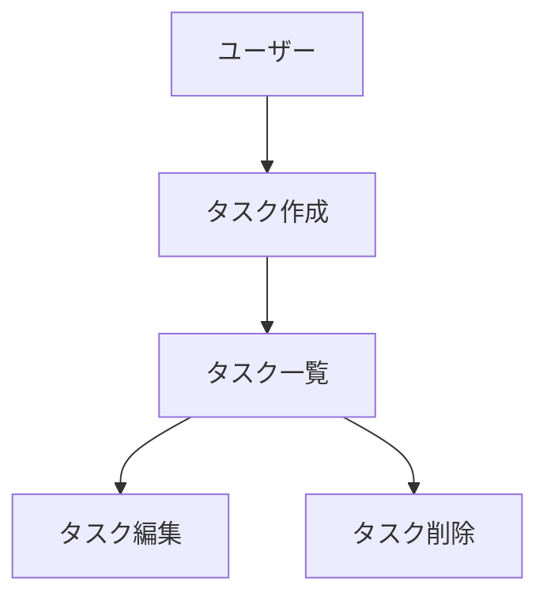

# CLAUDE.md (プロジェクトメモリ)

## 概要
開発を進めるうえで遵守すべき標準ルールを定義します。

## プロジェクト構造

### ドキュメントの分類

#### 1. 永続的ドキュメント（`docs/`）

アプリケーション全体の「**何を作るか**」「**どう作るか**」を定義する恒久的なドキュメント。
アプリケーションの基本設計や方針が変わらない限り更新されません。

- **product-requirements.md** - プロダクト要求定義書
  - プロダクトビジョンと目的
  - ターゲットユーザーと課題・ニーズ
  - 主要な機能一覧
  - 成功の定義
  - ビジネス要件
  - ユーザーストーリー
  - 受け入れ条件
  - 機能要件
  - 非機能要件

- **functional-design.md** - 機能設計書
  - 機能ごとのアーキテクチャ
  - システム構成図
  - データモデル定義（ER図含む）
  - コンポーネント設計
  - ユースケース図、画面遷移図、ワイヤフレーム
  - API設計（将来的にバックエンドと連携する場合）

- **architecture.md** - 技術仕様書
  - テクノロジースタック
  - 開発ツールと手法
  - 技術的制約と要件
  - パフォーマンス要件

- **repository-structure.md** - リポジトリ構造定義書
  - フォルダ・ファイル構成
  - ディレクトリの役割
  - ファイル配置ルール

- **development-guidelines.md** - 開発ガイドライン
  - コーディング規約
  - 命名規則
  - スタイリング規約
  - テスト規約
  - Git規約

- **glossary.md** - ユビキタス言語定義
  - ドメイン用語の定義
  - ビジネス用語の定義
  - UI/UX用語の定義
  - 英語・日本語対応表
  - コード上の命名規則


#### 2. 作業単位のドキュメント（`.steering/[YYYYMMDD]-[開発タイトル]/`）

特定の開発作業における「**今回何をするか**」を定義する一時的なステアリングファイル。
作業完了後は参照用として保持されますが、新しい作業では新しいディレクトリを作成します。

- **requirements.md** - 今回の作業の要求内容
  - 変更・追加する機能の説明
  - ユーザーストーリー
  - 受け入れ条件
  - 制約事項

- **design.md** - 変更内容の設計
  - 実装アプローチ
  - 変更するコンポーネント
  - データ構造の変更
  - 影響範囲の分析

- **tasklist.md** - タスクリスト
  - 具体的な実装タスク
  - タスクの進捗状況
  - 完了条件

### ステアリングディレクトリの命名規則

```
.steering/[YYYYMMDD]-[開発タイトル]/
```

**例：**
- `.steering/20250103-initial-implementation/`
- `.steering/20250115-add-tag-feature/`
- `.steering/20250120-fix-filter-bug/`
- `.steering/20250201-improve-performance/`

## 開発プロセス

### 初回セットアップ時の手順

#### 1. フォルダ作成
```bash
mkdir -p docs
mkdir -p .steering
```

#### 2. 永続的ドキュメント作成（`docs/`）

アプリケーション全体の設計を定義します。
各ドキュメントを作成後、必ず確認・承認を得てから次に進みます。

1. `docs/product-requirements.md` - プロダクト要求定義書
2. `docs/functional-design.md` - 機能設計書
3. `docs/architecture.md` - 技術仕様書
4. `docs/repository-structure.md` - リポジトリ構造定義書
5. `docs/development-guidelines.md` - 開発ガイドライン
6. `docs/glossary.md` - ユビキタス言語定義

**重要：** 1ファイルごとに作成後、必ず確認・承認を得てから次のファイル作成を行う

#### 3. 初回実装用のステアリングファイル作成

初回実装用のディレクトリを作成し、実装に必要なドキュメントを配置します。

```bash
mkdir -p .steering/[YYYYMMDD]-initial-implementation
```

作成するドキュメント：
1. `.steering/[YYYYMMDD]-initial-implementation/requirements.md` - 初回実装の要求
2. `.steering/[YYYYMMDD]-initial-implementation/design.md` - 実装設計
3. `.steering/[YYYYMMDD]-initial-implementation/tasklist.md` - 実装タスク

#### 4. 環境セットアップ

#### 5. 実装開始

`.steering/[YYYYMMDD]-initial-implementation/tasklist.md` に基づいて実装を進めます。

#### 6. 品質チェック

### 機能追加・修正時の手順

#### 1. 影響分析

- 永続的ドキュメント（`docs/`）への影響を確認
- 変更が基本設計に影響する場合は `docs/` を更新

#### 2. ステアリングディレクトリ作成

新しい作業用のディレクトリを作成します。

```bash
mkdir -p .steering/[YYYYMMDD]-[開発タイトル]
```

**例：**
```bash
mkdir -p .steering/20250115-add-tag-feature
```

#### 3. 作業ドキュメント作成

作業単位のドキュメントを作成します。
各ドキュメント作成後、必ず確認・承認を得てから次に進みます。

1. `.steering/[YYYYMMDD]-[開発タイトル]/requirements.md` - 要求内容
2. `.steering/[YYYYMMDD]-[開発タイトル]/design.md` - 設計
3. `.steering/[YYYYMMDD]-[開発タイトル]/tasklist.md` - タスクリスト

**重要：** 1ファイルごとに作成後、必ず確認・承認を得てから次のファイル作成を行う

#### 4. 永続的ドキュメント更新（必要な場合のみ）

変更が基本設計に影響する場合、該当する `docs/` 内のドキュメントを更新します。

#### 5. 実装開始

`.steering/[YYYYMMDD]-[開発タイトル]/tasklist.md` に基づいて実装を進めます。

#### 6. 品質チェック

## ドキュメント管理の原則

### 永続的ドキュメント（`docs/`）
- アプリケーションの基本設計を記述
- 頻繁に更新されない
- 大きな設計変更時のみ更新
- プロジェクト全体の「北極星」として機能

### 作業単位のドキュメント（`.steering/`）
- 特定の作業・変更に特化
- 作業ごとに新しいディレクトリを作成
- 作業完了後は履歴として保持
- 変更の意図と経緯を記録

## 図表・ダイアグラムの記載ルール

### 記載場所
設計図やダイアグラムは、関連する永続的ドキュメント内に直接記載します。
独立したdiagramsフォルダは作成せず、手間を最小限に抑えます。

**配置例：**
- ER図、データモデル図 → `functional-design.md` 内に記載
- ユースケース図 → `functional-design.md` または `product-requirements.md` 内に記載
- 画面遷移図、ワイヤフレーム → `functional-design.md` 内に記載
- システム構成図 → `functional-design.md` または `architecture.md` 内に記載

### 記述形式
1. **Mermaid記法（推奨）**
   - Markdownに直接埋め込める
   - バージョン管理が容易
   - ツール不要で編集可能



2. **ASCII アート**
   - シンプルな図表に使用
   - テキストエディタで編集可能

```
┌─────────────┐
│   Header    │
└─────────────┘
       │
       ↓
┌─────────────┐
│  Task List  │
└─────────────┘
```

3. **画像ファイル（必要な場合のみ）**
   - 複雑なワイヤフレームやモックアップ
   - `docs/images/` フォルダに配置
   - PNG または SVG 形式を推奨

### 図表の更新
- 設計変更時は対応する図表も同時に更新
- 図表とコードの乖離を防ぐ

## READMEの多言語対応仕様

### 基本方針

プロジェクトの性質・対象ユーザーに応じて、主要なREADMEファイルを多言語で提供します。

### 言語選定プロセス

**IMPORTANT**: 多言語対応を実施する前に、必ず以下をユーザーに確認すること：

1. **対応言語の選定**
   - どの言語を対応するか（日本語・英語・その他）

2. **デフォルト言語の決定**
   - どちらの言語を `README.md`（デフォルト）とするか
   - 判断基準：
     - プロジェクトの主要ユーザー層の言語
     - プロダクトの対象地域
     - コミュニティの主要言語

3. **対象範囲の確認**
   - どのREADMEファイルを多言語化するか
   - ルートREADMEのみか、サブディレクトリも含むか

### ファイル命名規則

| 言語 | ファイル名 | 用途 |
|------|-----------|------|
| **デフォルト言語** | `README.md` | 主要ターゲットユーザーの言語 |
| **副言語（英語）** | `README.en.md` | 英語が副言語の場合 |
| **副言語（日本語）** | `README.ja.md` | 日本語が副言語の場合 |
| **その他の言語** | `README.[言語コード].md` | ISO 639-1 コードを使用 |

### 言語切り替えリンク

各READMEファイルの**冒頭**（タイトル直後）に、言語切り替えリンクを配置します。

**パターン1：デフォルトが日本語の場合**
```markdown
# プロジェクトタイトル

**Read this in other languages: 日本語 | [English](README.en.md)**

本文...
```

**パターン2：デフォルトが英語の場合**
```markdown
# Project Title

**Read this in other languages: [日本語](README.ja.md) | English**

Content...
```

**パターン3：3言語以上対応の場合**
```markdown
# Title

**Read this in other languages: [日本語](README.ja.md) | English | [中文](README.zh.md)**
```

### ディレクトリ構造例

```
プロジェクトルート/
├── README.md              # デフォルト言語
├── README.[言語コード].md  # 副言語
├── サブディレクトリ/
│   ├── README.md
│   └── README.[言語コード].md
```

### 内容の同期性

1. **同期の原則**
   - すべての言語版は内容を同期させる
   - 機能追加・変更時は**全言語版を同時に更新**
   - PRレビュー時に全言語版の整合性を確認

2. **翻訳の品質**
   - 技術用語は正確に翻訳（または原語併記）
   - コードブロック、コマンド、設定例は全言語共通
   - スクリーンショットは可能な限り言語中立的に

3. **部分的な未翻訳の扱い**
   - 緊急の更新時、一時的に一部言語のみ更新することを許容
   - その場合、未更新の言語版に警告を追記：
     ```markdown
     > ⚠️ **Note**: This document may be outdated. See [English version](README.en.md) for the latest information.
     ```

### 対象範囲の判断基準

| ドキュメント種別 | 多言語対応 | 備考 |
|----------------|----------|------|
| **ルート README.md** | ✅ 必須 | プロジェクトの顔 |
| **サブディレクトリのREADME** | △ ユーザー確認 | 重要度に応じて判断 |
| **CONTRIBUTING.md** | △ 英語のみでも可 | 開発者向け（国際性高い） |
| **docs/ 内のドキュメント** | △ プロジェクト依存 | 必要に応じて |
| **コード内コメント** | ❌ 英語推奨 | 国際的な可読性 |
| **コミットメッセージ** | ❌ 英語推奨 | Git履歴の国際性 |

### 更新フロー

1. **READMEの更新が必要になった場合**
   - デフォルト言語版を更新
   - 副言語版も同時に更新（または一時的に未更新警告を追加）

2. **PRレビュー時のチェック項目**
   - [ ] 全言語版の内容が同期しているか
   - [ ] コードブロック・コマンドが全言語版で一致しているか
   - [ ] 言語切り替えリンクが正しく機能するか

### プロジェクト開始時のチェックリスト

多言語対応READMEを作成する際、以下を確認：

- [ ] ユーザーに対象言語を確認した
- [ ] ユーザーにデフォルト言語を確認した（日本語 or 英語）
- [ ] 多言語化の対象範囲を確認した（ルートのみ / サブディレクトリ含む）
- [ ] 言語切り替えリンクを両言語版の冒頭に配置した
- [ ] 内容の同期性を確保した

## 注意事項

- ドキュメントの作成・更新は段階的に行い、各段階で承認を得る
- `.steering/` のディレクトリ名は日付と開発タイトルで明確に識別できるようにする
- 永続的ドキュメントと作業単位のドキュメントを混同しない
- コード変更後は必ずリント・型チェックを実施する
- 共通のデザインシステム（Tailwind CSS）を使用して統一感を保つ
- セキュリティを考慮したコーディング（XSS対策、入力バリデーションなど）
- 図表は必要最小限に留め、メンテナンスコストを抑える
