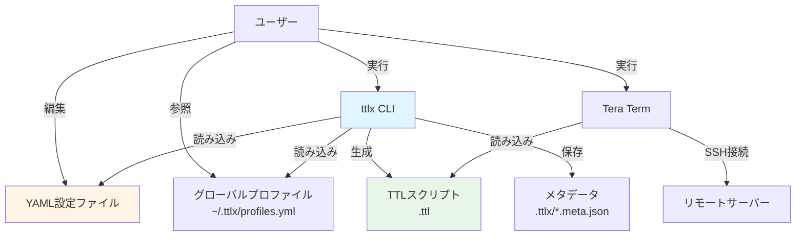
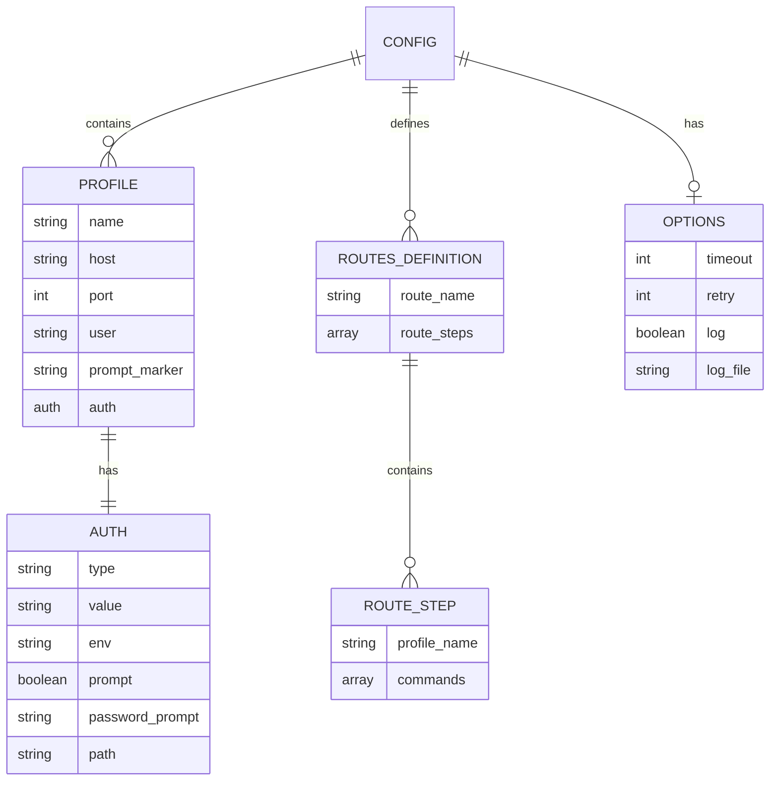
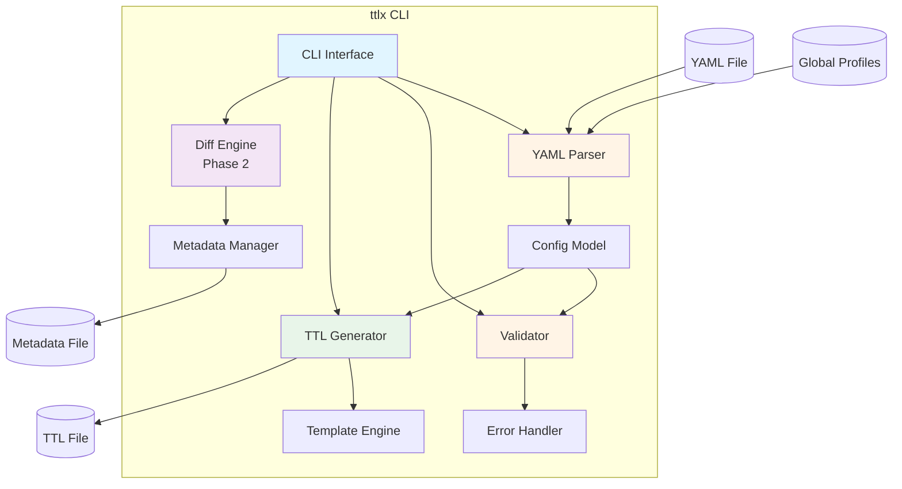
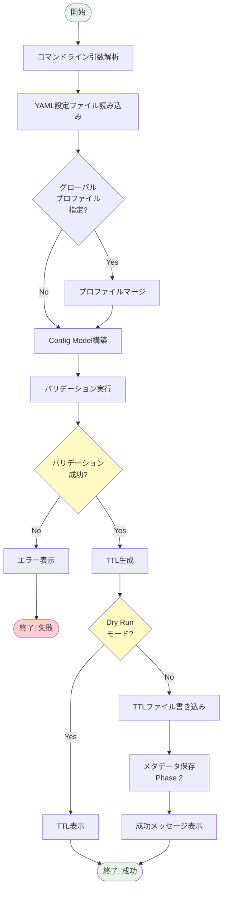
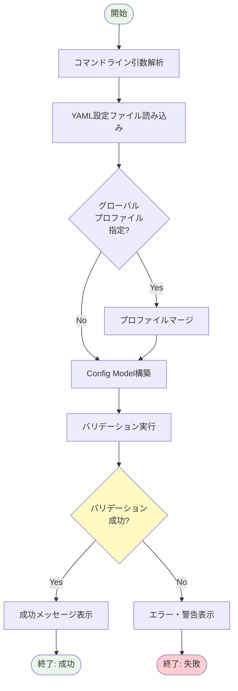
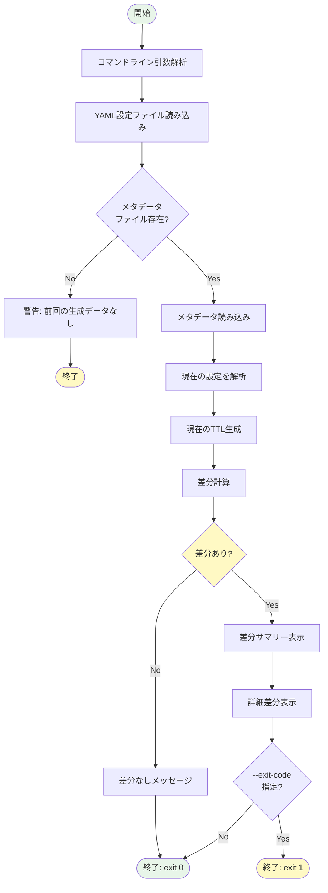
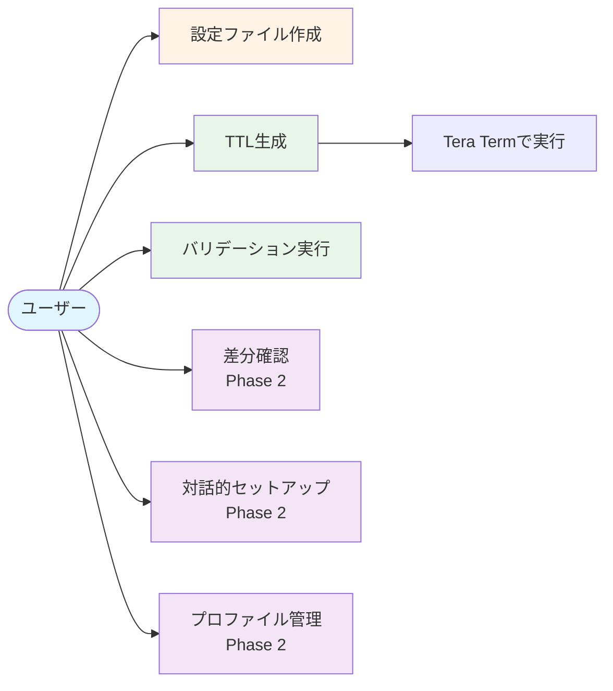

# 機能設計書

## 概要

本ドキュメントでは、ttlx（Tera Term Language eXtended）の機能設計を定義します。システム構成、データモデル、コンポーネント設計、処理フローを明確にし、実装の指針とします。

---

## システム構成

### 全体構成図



### コンポーネント一覧

| コンポーネント | 説明 | 形式 |
|--------------|------|------|
| **YAML設定ファイル** | ユーザーが作成する接続・コマンド定義 | `.yml` |
| **グローバルプロファイル** | 再利用可能な接続設定（オプション） | `.yml` |
| **ttlx CLI** | YAML → TTL 変換ツール | 実行ファイル |
| **TTLスクリプト** | 生成されるTera Termマクロ | `.ttl` |
| **メタデータファイル** | 差分表示用のスナップショット（Phase 2） | `.json` |
| **Tera Term** | TTLスクリプトを実行する端末エミュレータ | アプリケーション |

---

## データモデル定義

### ルート（routes）の設計思想

**ルート** は、複数のプロファイルを組み合わせた接続シーケンスを定義します。

- **routes**: キーがルート名、値が **ルートステップの配列** であるマップ構造
- **ルートステップ**: 各ステップは1つのプロファイルと、それに続くコマンドを含む
- **複数ルート対応**: 異なる接続シーケンスを複数定義可能（例: `main`、`backup`、`debug`）

例：
```yaml
routes:
  main:                    # ルート名: main
    - profile: bastion    # ステップ1: bastion に接続
      commands:
        - su - root       # ステップ1 のコマンド
    - profile: prod-db    # ステップ2: prod-db に接続
      commands:
        - pwd            # ステップ2 のコマンド

  backup:                  # ルート名: backup （異なるシーケンス）
    - profile: bastion
    - profile: backup-db
```

### YAML設定ファイルのスキーマ

#### Phase 1 (MVP) スキーマ

```yaml
# バージョン番号（必須）
version: "1.0"

# 接続プロファイル定義（必須）
profiles:
  <profile_name>:
    host: string           # ホスト名またはIPアドレス（必須）
    port: integer          # ポート番号（任意、デフォルト: 22）
    user: string           # ユーザー名（必須）
    prompt_marker: string  # プロンプト識別文字列（必須）例: "$ ", "# "
    auth:                  # 認証設定（必須）
      type: "password" | "keyfile"  # 認証タイプ
      # パスワード認証の場合
      value: string        # パスワード直接記述（非推奨）
      env: string          # 環境変数名
      prompt: boolean      # 実行時入力
      password_prompt: string  # パスワード入力待機文字列（2段目以降で必須）例: "password:"
      # 公開鍵認証の場合
      path: string         # 秘密鍵ファイルパス

# 接続ルート定義（必須）
routes:
  <route_name>:           # ルート名（キー）
    - profile: string     # プロファイル名（必須）
      commands:           # この接続後に実行するコマンド（任意）
        - string          # コマンド文字列

# オプション設定（任意）
options:
  timeout: integer       # タイムアウト（秒）
  retry: integer         # リトライ回数
  log: boolean           # ログ取得
  log_file: string       # ログファイルパス
  auto_disconnect: boolean  # 最終ステップ完了後に自動切断するか（デフォルト: false）
```

#### Phase 2 追加スキーマ

```yaml
# プロファイルインポート（Phase 2）
import_profiles: string  # グローバルプロファイルファイルパス

# 変数定義（Phase 2）
vars:
  <var_name>: <var_value>

# プロファイル固有のオプション（Phase 2）
profiles:
  <profile_name>:
    # ... 基本設定
    options:
      timeout: integer
      on_timeout: "retry" | "abort" | "prompt"
      retry_count: integer
      retry_interval: integer
      on_connection_failed: "abort" | "retry"
      on_auth_failed: "abort" | "prompt"

# ルートステップ固有のオプション（Phase 2）
routes:
  <route_name>:
    - profile: string
      commands: [...]
      options:             # このステップ固有のオプション
        timeout: integer
        wait_prompt: string  # コマンド実行後の待機プロンプト
```

### データ構造図（ER図風）



### メタデータファイル構造（Phase 2）

```json
{
  "source": "config.yml",
  "generated_at": "2025-12-31T10:00:00Z",
  "source_hash": "abc123...",
  "ttl_path": "output.ttl",
  "config_snapshot": {
    "version": "1.0",
    "profiles": { ... },
    "routes": {
      "route_name": [ ... ]
    }
  }
}
```

---

## コンポーネント設計

### アーキテクチャ図



### コンポーネント詳細

#### 1. CLI Interface
**責務**: コマンドライン引数の解析とコマンド実行

**主要機能**:
- コマンド解析（`build`, `validate`, `diff`, `init` など）
- オプション解析（`-o`, `--dry-run` など）
- ヘルプメッセージ表示
- エラーメッセージ表示

**入力**: コマンドライン引数
**出力**: 実行結果（標準出力、終了コード）

---

#### 2. YAML Parser
**責務**: YAML設定ファイルの読み込みと解析

**主要機能**:
- YAML ファイルの読み込み
- グローバルプロファイルのマージ（Phase 2）
- 変数展開（Phase 2）
- Config Model への変換

**入力**: YAML ファイルパス
**出力**: Config Model オブジェクト

---

#### 3. Validator
**責務**: 設定ファイルの妥当性検証

**主要機能**:
- スキーマバリデーション（必須項目、型チェック）
- セマンティックバリデーション（プロファイル参照の整合性）
- セキュリティチェック（平文パスワード警告）
- エラー・警告メッセージの生成

**入力**: Config Model オブジェクト
**出力**: バリデーション結果（成功/失敗、エラーリスト）

**バリデーションルール**:
- `version` フィールドが存在する
- `profiles` に少なくとも1つのプロファイルが定義されている
- `routes` に少なくとも1つのルートが定義されている
- `routes` の各ルート内の各ステップで指定された `profile` が `profiles` に存在する
- 2段目以降のステップに認証が必要な場合、`password_prompt` が設定されている
- 各プロファイルに `prompt_marker` が設定されている
- 認証設定が正しい（`password` の場合は `value` | `env` | `prompt` のいずれか）
- ホスト名、ポート番号が妥当な形式
- `commands` が指定されている場合、配列形式である

---

#### 4. TTL Generator
**責務**: Config Model から TTL スクリプトを生成

**主要機能**:
- TTL スクリプトのテンプレート生成
- 接続処理の生成（多段SSH対応）
- 認証処理の生成（パスワード/公開鍵）
- コマンド実行処理の生成
- エラーハンドリングコードの生成
- コメント・ヘッダーの生成

**入力**: Config Model オブジェクト
**出力**: TTL スクリプト（文字列）

**生成されるTTLの構造**:
```ttl
; ========================================
; Generated by ttlx v1.0.0
; Source: config.yml
; Generated at: 2025-12-31 10:00:00
; ========================================

; === 変数定義 ===
timeout = 30
retry_count = 3

; === ステップ1: bastion ===
:CONNECT_BASTION
connect 'bastion.example.com:22 /ssh /auth=password /user=user1'
if result <> 2 then
    goto ERROR_CONNECT_BASTION
endif
wait '$'
if result = 0 then
    goto TIMEOUT_BASTION
endif

; === ステップ1: コマンド実行 ===
sendln 'su - root'
wait '#'

; === ステップ2: target ===
sendln 'ssh user2@10.0.0.50 -p 22'
wait 'password:'
if result = 0 then
    goto TIMEOUT_TARGET
endif
; ... パスワード入力処理

wait '$'

; === ステップ2: コマンド実行 ===
sendln 'ls -la'
wait '$'
sendln 'pwd'
wait '$'

; === 正常終了 ===
:SUCCESS
closett
end

; === エラーハンドリング ===
:ERROR_CONNECT_BASTION
messagebox 'Bastion接続エラー' 'エラー'
goto CLEANUP

:TIMEOUT_BASTION
messagebox 'Bastion接続タイムアウト' 'エラー'
goto CLEANUP

:TIMEOUT_TARGET
messagebox 'Target接続タイムアウト' 'エラー'
goto CLEANUP

:CLEANUP
closett
end
```

---

#### 5. Diff Engine（Phase 2）
**責務**: 設定変更前後の TTL 差分を表示

**主要機能**:
- メタデータファイルの読み込み
- 現在の設定から TTL を生成
- 前回の TTL との差分計算（unified diff）
- 設定レベルの差分抽出（どのプロファイルが変更されたか）
- 差分の視覚的表示

**入力**: 現在の Config Model、メタデータファイル
**出力**: 差分表示（標準出力）

---

#### 6. Metadata Manager（Phase 2）
**責務**: メタデータファイルの管理

**主要機能**:
- メタデータファイルの保存
- メタデータファイルの読み込み
- 設定ファイルのハッシュ計算
- スナップショット管理

**入力**: Config Model、TTL パス
**出力**: メタデータファイル（JSON）

---

#### 7. Template Engine
**責務**: TTL コード生成のテンプレート処理

**主要機能**:
- TTL コードテンプレートの管理
- テンプレート変数の展開
- コードブロックの組み立て

**使用例**:
- 接続処理テンプレート
- 認証処理テンプレート
- エラーハンドリングテンプレート

---

#### 8. Error Handler
**責務**: エラーメッセージの統一的な処理

**主要機能**:
- エラーメッセージのフォーマット
- 多言語対応（日本語・英語）
- エラーレベルの管理（Error, Warning, Info）
- 修正提案の生成

---

## 処理フロー

### `ttlx build` コマンドの処理フロー



### `ttlx validate` コマンドの処理フロー



### `ttlx diff` コマンドの処理フロー（Phase 2）



---

## ユースケース図



### 主要ユースケース詳細

#### UC-001: TTL生成
**アクター**: ユーザー

**事前条件**: YAML設定ファイルが存在する

**基本フロー**:
1. ユーザーが `ttlx build config.yml` を実行
2. システムがYAMLを読み込む
3. システムがバリデーションを実行
4. システムがTTLを生成
5. システムがファイルに書き込む
6. システムが成功メッセージを表示

**代替フロー**:
- 3a. バリデーション失敗 → エラー表示、終了
- 4a. Dry Runモード → 画面表示のみ、終了

**事後条件**: TTLファイルが生成される

---

#### UC-002: バリデーション実行
**アクター**: ユーザー

**事前条件**: YAML設定ファイルが存在する

**基本フロー**:
1. ユーザーが `ttlx validate config.yml` を実行
2. システムがYAMLを読み込む
3. システムがバリデーションを実行
4. システムが結果を表示

**代替フロー**:
- 3a. エラー検出 → エラー詳細表示
- 3b. 警告検出 → 警告表示（終了コード0）

**事後条件**: なし（検証のみ）

---

#### UC-003: 差分確認（Phase 2）
**アクター**: ユーザー

**事前条件**:
- YAML設定ファイルが存在する
- 過去に一度TTLを生成している（メタデータが存在）

**基本フロー**:
1. ユーザーが `ttlx diff config.yml` を実行
2. システムがメタデータを読み込む
3. システムが現在のYAMLから仮TTLを生成
4. システムが差分を計算
5. システムが差分を表示

**代替フロー**:
- 2a. メタデータなし → 警告表示、終了
- 4a. 差分なし → 差分なしメッセージ、終了

**事後条件**: なし（表示のみ）

---

## 画面設計（CLI出力例）

### `ttlx build` の成功時出力

```
✓ YAML設定ファイルを読み込みました: config.yml
✓ バリデーション成功
✓ TTL生成完了

Generated: production-db.ttl
Source: config.yml
Profiles: bastion, prod-db
Commands: 2

次のステップ:
  Tera Termで production-db.ttl を実行してください
```

### `ttlx validate` のエラー出力

```
✗ バリデーションエラー

config.yml:
  [エラー] プロファイル 'target' が見つかりません (line 15)
    routes:
      main:
        - profile: bastion
        - profile: target  ← このプロファイルが未定義です

  [警告] パスワードが平文で記述されています (line 8)
    推奨: 環境変数または実行時入力を使用してください

修正後、再度実行してください: ttlx validate config.yml
```

### `ttlx diff` の出力例（Phase 2）

```
Comparing:
  Previous: production-db.ttl (generated 2025-12-31 09:00:00)
  Current:  production-db.yml (modified 2025-12-31 10:30:00)

Summary of changes:
  Profiles modified: 1
    - bastion: timeout updated (10 → 30)
  Commands: +1 -0

Diff:
────────────────────────────────────────────────────
--- production-db.ttl (previous)
+++ production-db.ttl (current)
@@ -5,7 +5,7 @@

 ; === プロファイル: bastion ===
-timeout = 10
+timeout = 30
 connect 'bastion.example.com:22 /ssh'

@@ -20,6 +20,7 @@
 ; === コマンド実行 ===
 sendln 'show databases;'
+sendln 'show tables;'
────────────────────────────────────────────────────

? この変更でTTLを生成しますか？ (Y/n)
```

---

## API設計

ttlx はスタンドアロンCLIツールのため、外部APIは提供しません。将来的にライブラリとして使用できるよう、内部APIを設計します。

### 内部API（将来のライブラリ化を想定）

```python
# 疑似コード（実装言語未定）

class TTLXConfig:
    """YAML設定を表現するモデル"""
    def __init__(self, yaml_path: str)
    def load(self) -> None
    def merge_global_profiles(self, global_path: str) -> None
    def to_dict(self) -> dict

class TTLXValidator:
    """設定の妥当性を検証"""
    def __init__(self, config: TTLXConfig)
    def validate(self) -> ValidationResult

class TTLXGenerator:
    """TTL生成"""
    def __init__(self, config: TTLXConfig)
    def generate(self) -> str
    def write(self, output_path: str) -> None

class TTLXDiffer:
    """差分計算（Phase 2）"""
    def __init__(self, current_config: TTLXConfig, metadata_path: str)
    def diff(self) -> DiffResult
    def show(self) -> None
```

---

## 制約事項と技術的考慮事項

### 制約事項
1. **Tera Term依存**: 生成されるTTLは、Tera Term 4.106以降で動作することを保証
2. **SSH専用（MVP）**: Phase 1では SSH 接続のみサポート
3. **シングルスレッド**: CLI実行は同期処理（並列処理なし）

### 技術的考慮事項
1. **YAML解析**: 標準的なYAMLライブラリを使用（PyYAML、go-yaml など）
2. **テンプレートエンジン**: TTL生成にはテンプレートエンジンまたは文字列ビルダーを使用
3. **エラーハンドリング**: ユーザーフレンドリーなエラーメッセージを提供
4. **拡張性**: Phase 2以降の機能追加を考慮した設計
5. **セキュリティ**: パスワード平文記述の警告、ファイルパーミッションチェック

---

## 将来的な拡張（Phase 3以降）

### コマンドテンプレート機能
- よく使うコマンドシーケンスをテンプレート化
- テンプレートライブラリの管理

### IDE拡張（VSCode）
- YAML設定ファイルのシンタックスハイライト
- 自動補完（プロファイル名、コマンド）
- リアルタイムバリデーション
- TTLプレビュー

### 設定ファイル暗号化
- パスワードやSSH鍵の暗号化保存
- マスターパスワードによる復号化

### Web UI（検討中）
- ブラウザベースの設定ファイルエディタ
- TTL生成・プレビュー
- プロファイル管理

---

## まとめ

本機能設計書では、ttlx のシステム構成、データモデル、コンポーネント設計、処理フローを定義しました。これにより、実装時の指針が明確になり、開発者間での認識の齟齬を防ぐことができます。

次のステップとして、技術仕様書（`architecture.md`）で実装言語やツールチェーンを決定します。
